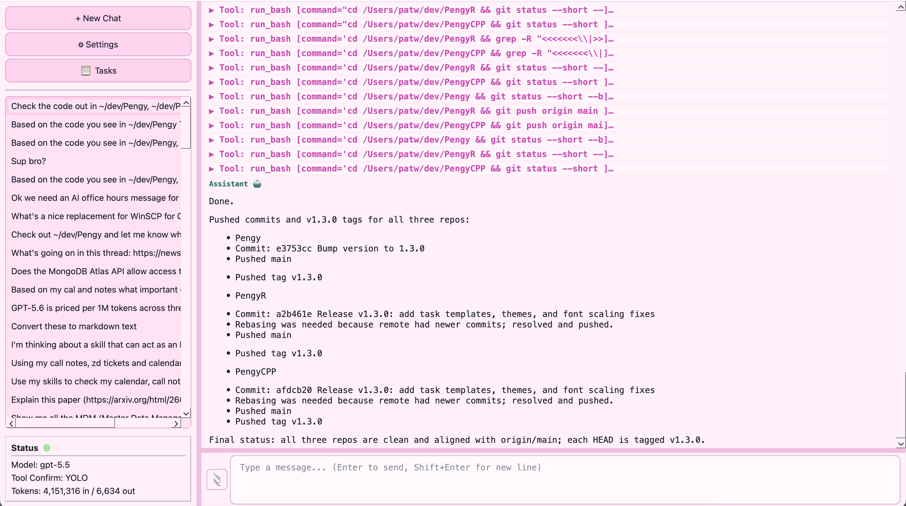
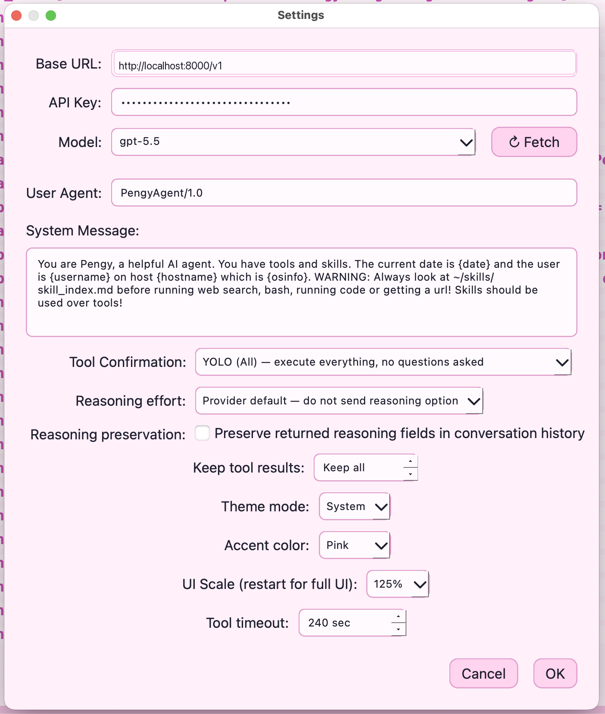
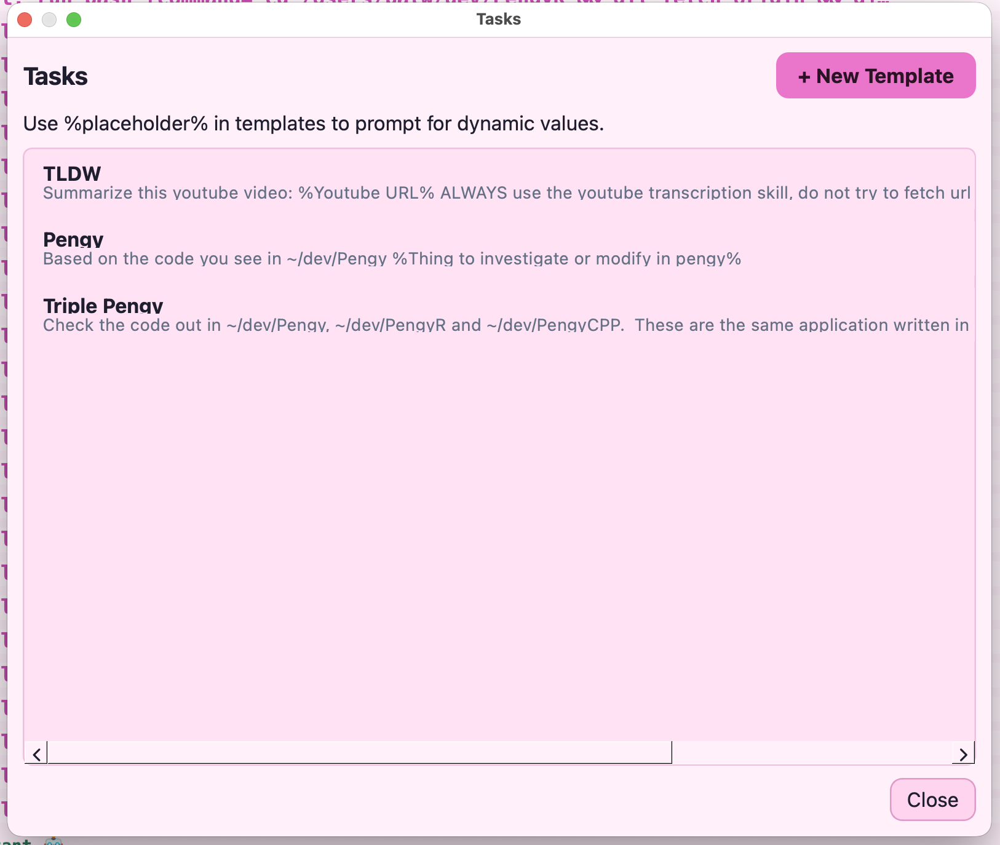

# PengyR 🐧

**A local-first AI agent with tools.** Desktop GUI, web UI, **and** command-line — all backed by the same agent core, talking to any OpenAI-compatible API. A Rust + Qt6 port of [Pengy](https://github.com/patw/pengy), sharing the same `~/.config/pengy/` data.

[](https://github.com/patw/PengyR/releases)
[](https://github.com/patw/PengyR/blob/main/LICENSE)

---

## What is PengyR?

PengyR is an LLM agent that runs on your own machine. It connects to OpenAI, Ollama, vLLM, Groq, OpenRouter, or any local endpoint, and gives the model a set of tools to operate on your filesystem, run code, search the web, and fetch URLs — all with your approval.

Three interfaces, one agent:

| **🐧 PengyR Desktop** | **🐧 PengyR CLI** | **🐧 PengyR Web** |
|---|---|---|
| Qt6 GUI with markdown rendering, multi-session sidebar, file attachments | Terminal REPL with slash commands, single-shot mode for scripting | Axum web UI with Bootstrap, responsive layout, SSE live streaming |

All three share the same core — same tools, same chat history, same config. Use whichever fits your flow.

---

## Quick Start

### Download Pre-built Releases

Pre-built binaries are available on the [Releases page](https://github.com/patw/PengyR/releases):

| Platform | Format |
|----------|--------|
| **Linux** | `PengyR-x86_64.AppImage` (portable, no system deps) · `.deb` (Debian/Ubuntu) |
| **macOS** | `PengyR-<arch>.dmg` (arm64 / x86_64) |
| **Windows** | `PengyR-Windows.zip` (bundled Qt DLLs, unzip and run) |

### Linux — Build from Source

```bash
# Dependencies (Ubuntu/Debian)
sudo apt install build-essential cmake qt6-base-dev libgl-dev

# Install Rust
curl --proto '=https' --tls v1.2 -sSf https://sh.rustup.rs | sh

# Build everything (GUI + CLI + Web)
./build_linux.sh

# GUI
./gui/build/pengy

# CLI (interactive)
./target/release/pengy-cli

# CLI (single-shot)
./target/release/pengy-cli "What is the capital of France?"
./target/release/pengy-cli --no-save "quick question"

# Web UI
./target/release/pengy-web              # http://localhost:5000
./target/release/pengy-web 8080        # custom port

# Install CLI + Web to ~/.local/bin/
./install.sh
```

### Linux AppImage

```bash
./build_linux.sh
cd appimage && ./build.sh
# → PengyR-x86_64.AppImage
```

### macOS

```bash
brew install qt@6 cmake rust
./build_macos.sh [arm64|x86_64]
# → Pengy.app
# → PengyR-macOS-<arch>.dmg
```

### Windows

```
REM Prerequisites: Rust, Qt6 (MSVC 64-bit), VS Build Tools 2022, CMake
REM Run from a VS Developer Command Prompt:
build_windows.bat
REM → PengyR-Windows\pengy.exe
```

---

## Features

- **OpenAI-compatible** — Works with OpenAI, Ollama, vLLM, LM Studio, OpenRouter, Groq, or any local endpoint
- **11 built-in tools** — Read, write, and edit files; run bash (with sudo support) and Python code; search the web and fetch URLs; explore directory trees and search codebases
- **Agentic workflow** — The LLM can call multiple tools per turn, chaining them to accomplish complex tasks
- **Tool confirmation** — Three modes: YOLO (All) skips all confirmations, Safe auto-approves read-only tools, None confirms everything
- **Context management** — Elide old tool results to save context window space; configurable per-chat
- **Token usage display** — See prompt/completion token counts after every turn (GUI sidebar + CLI footer)
- **Theme system** — System, light, and dark modes plus selectable accent colors; applied across the desktop UI with scaled markdown/code rendering
- **Tasks system** — Reusable prompt templates for repeated workflows, with `%placeholder%` inputs collected at run time
- **Model discovery** — Fetch available models from your endpoint with one click or `/models` command
- **Multi-session** — Create, switch, and delete chat sessions; history saved locally as JSON; shared across all interfaces
- **File attachments** — GUI: attach files from the input bar, paste images from clipboard; CLI: use `@path` inline syntax
- **Image rendering** — Pasted and downloaded images display inline in the GUI
- **Web UI** — Responsive Bootstrap interface served by Axum; SSE live streaming; works great on mobile
- **Slash commands** (CLI) — `/new`, `/load`, `/models`, `/yolo`, `/model`, `/list`, `/delete`, `/attach`, `/compact`, and more
- **Templated system message** — Auto-fills `{date}`, `{username}`, `{hostname}`, `{osinfo}` at send time
- **Persistent config** — Settings, task templates, and chat history live in `~/.config/pengy/`, shared with all Pengy versions (Python, Rust, C++)
- **Cross-version interop** — Chats created in Python Pengy load seamlessly in PengyR, and vice versa

---

## Screenshots

| Main chat UI | Settings / theme controls | Tasks templates |
|---|---|---|
|  |  |  |

---

## Configuration

**Desktop:** Click ⚙ Settings in the sidebar.  
**CLI:** Run `/config` to view, `/model <name>` to switch models.  
**Web:** Click ⚙ in the top-right navbar.

| Setting | Description |
|---------|-------------|
| Base URL | API endpoint (e.g. `http://localhost:11434/v1` for Ollama) |
| API Key | Your API key (or anything for local endpoints) |
| Model | Model name, e.g. `gpt-4o`, `llama3`, `gemma` |
| System Message | Supports `{date}`, `{username}`, `{hostname}`, `{osinfo}` placeholders |
| Tool Confirmation | YOLO (All) / Safe Only / None — controls which tools require approval |
| Theme Mode (GUI) | System / Light / Dark — System follows the OS palette |
| Accent Color (GUI) | Default, Blue, Teal, Green, Orange, Red, Pink, or Purple |
| UI Scale (GUI) | 75 / 100 / 125 / 150 / 175 / 200 % — restart for full native-widget scaling |

---

## Theme System

The desktop UI includes a theme system built around two choices:

- **Mode:** `System`, `Light`, or `Dark`. `System` follows the current OS/Qt palette.
- **Accent:** `Default`, `Blue`, `Teal`, `Green`, `Orange`, `Red`, `Pink`, or `Purple`. The accent drives buttons, links, focus rings, selection colours, and other highlights.

Theme settings are saved in `~/.config/pengy/settings.json` as `theme_mode`, `theme_accent`, and `ui_scale`, so they travel with the rest of your local Pengy configuration. The renderer also scales explicit markdown, code, and input fonts so the chat view tracks the configured UI scale instead of only resizing native widgets.

---

## Tasks

Tasks are reusable prompt templates for workflows you repeat often — for example summarizing a YouTube video, drafting a release note, or running a standard code-review checklist. Open **Tasks** from the desktop sidebar to create, edit, delete, or play templates.

A task has a title and a prompt template. Use `%placeholder%` tokens anywhere in the template to ask for values when the task is played:

```text
Summarize this YouTube video: %Youtube Video URL%
Always use the youtube transcription skill.
```

When you click **▶ Play**, PengyR asks for each unique placeholder once, renders the final prompt, and sends it through the normal chat path so tools, skills, history, and confirmation settings all work exactly like a hand-written prompt. Tasks are stored locally in `~/.config/pengy/tasks.json` and are shared by the Python, Rust, and C++ editions.

---

## Tools

PengyR gives the LLM these tools to operate on your machine:

| Tool | Description |
|------|-------------|
| `read_file` / `read_multiple_files` | Read one or more files at once |
| `write_file` | Write or overwrite a file |
| `replace_in_file` | Targeted text replacement (safer than full rewrites) |
| `run_bash` | Execute shell commands (configurable timeout; sudo password dialog) |
| `run_python` | Execute Python code (uses system `python3`) |
| `web_search` | DuckDuckGo web search (via `primp` for browser-grade TLS) |
| `download_file` | Download a URL to `~/Downloads/` |
| `fetch_url` | Fetch a URL's text content into context |
| `directory_tree` | Visual directory structure listing |
| `search_content` | Regex search across files in a codebase |

---

## Skills

The 11 built-in tools cover the basics, but PengyR is designed to be extended with **skills** — your own custom instructions and scripts stored as plain markdown files.

Skills are not a plugin system. There is no SDK, no manifest file, no packaging. A skill is just a `skillname/skillname_skill.md` file with instructions PengyR can read, optionally backed by a bash or Python script. You point PengyR at a directory of these, and it uses them automatically.

This means your PengyR can do whatever you need it to:
- Fetch weather from an API
- Control devices on your home network
- Query your local databases
- Generate reports from your own data
- Run system administration tasks
- Send notifications, emails, or messages
- Anything you can describe in a prompt and a script

Skills are also self-authoring — you can ask PengyR to create new skills for you, write the markdown, write the script, and update the skill index, all in one conversation.

**📖 Read the full guide:** [`skills/README.md`](https://github.com/patw/Pengy/blob/main/skills/README.md) — covers the philosophy, how skills work, 4 complete examples with code, how to make your own, and a call to action to build your first skill.

---

## API Compatibility

| Service | Base URL |
|---------|----------|
| OpenAI | `https://api.openai.com/v1` |
| Ollama | `http://localhost:11434/v1` |
| LM Studio | `http://localhost:1234/v1` |
| vLLM | `http://localhost:8000/v1` |
| OpenRouter | `https://openrouter.ai/api/v1` |
| Groq | `https://api.groq.com/openai/v1` |

---

## Architecture

PengyR uses a Rust core library with three frontends:

| Layer | Language | What |
|-------|----------|------|
| Core logic | Rust | Config, chat/task CRUD, 11 tools, LLM chat loop (tokio async) |
| C FFI boundary | Rust `extern "C"` | 20 functions exported for C++ consumption |
| Desktop GUI | C++17 + Qt6 | QMainWindow, QSplitter, QTextBrowser markdown rendering |
| CLI | Rust | Interactive REPL with slash commands + single-shot mode |
| Web UI | Rust (Axum) | Bootstrap 5 UI with SSE streaming |

The Rust core is **statically linked** into the Qt6 binary — a single ~13 MB executable with no runtime Rust dependency. Qt6 shared libraries are bundled by the platform packager.

---

## Project Structure

```
PengyR/
├── Cargo.toml               # Workspace root + Rust core library
├── src/
│   ├── lib.rs               # Public modules + C FFI for Qt GUI
│   ├── config.rs            # Config: ~/.config/pengy/settings.json
│   ├── chat_manager.rs      # Chats: ~/.config/pengy/chats.json
│   ├── task_manager.rs      # Tasks: ~/.config/pengy/tasks.json
│   ├── tools.rs             # 11 OpenAI function-calling tools
│   └── llm_client.rs        # Async LLM chat loop (tokio)
├── cli/                     # CLI binary (pengy-cli)
│   ├── Cargo.toml
│   └── src/main.rs          # Interactive REPL + single-shot mode
├── web/                     # Web UI binary (pengy-web)
│   ├── Cargo.toml
│   └── src/main.rs          # Axum server + SSE + Bootstrap UI
├── gui/
│   ├── CMakeLists.txt       # Cross-platform Qt6 + CMake
│   ├── pengy_ffi.h          # C declarations for Rust core
│   ├── main.cpp             # Entry point
│   ├── mainwindow.cpp/h     # Three-pane main window
│   ├── chathistory.cpp/h    # Sidebar — chat list + quick settings
│   ├── chatview.cpp/h       # Chat display — markdown, tables, collapsible tool blocks
│   ├── chatinput.cpp/h      # Message input + attach button
│   ├── chatworker.cpp/h     # QThread worker → Rust FFI
│   ├── settingsdialog.cpp/h # Settings dialog + Fetch Models
│   ├── tasksdialog.cpp/h    # Task template manager/player
│   └── themehelper.h        # Light/dark/accent theme helpers
├── appimage/
│   ├── build.sh             # Bundles PengyR-x86_64.AppImage
│   ├── pengy.desktop        # Desktop entry
│   └── pengy.png            # App icon
├── build_linux.sh           # Linux native build
├── build_macos.sh           # macOS build (Homebrew Qt6)
├── build_windows.bat        # Windows build (MSVC Qt6)
├── build_deb.sh             # Debian/Ubuntu .deb package
├── install.sh               # Install CLI + Web to ~/.local/bin/
└── SPEC.md                  # Full architecture specification
```

---

## Interoperability

PengyR shares the same `~/.config/pengy/` directory as the Python Pengy and PengyCPP:
- **`settings.json`** — Same format, all versions read/write it
- **`chats.json`** — Same message schema. Chats created in any version load in any other
- **`tasks.json`** — Shared prompt-template library, including `%placeholder%` tokens

---

## Development

### Build from source

```bash
git clone https://github.com/patw/PengyR.git
cd PengyR

# Build all Rust targets (core + CLI + Web)
cargo build --release

# Build Qt6 GUI
mkdir -p gui/build && cd gui/build
cmake .. -DCMAKE_BUILD_TYPE=Release && make -j$(nproc)

# Run GUI
./gui/build/pengy

# Run tests
cargo test

# Format code
cargo fmt              # Rust
clang-format -i gui/*.cpp gui/*.h  # C++
```

---

## Dependencies

### Rust Core

| Crate | Purpose |
|-------|---------|
| `tokio` | Async runtime (multi-threaded) |
| `reqwest` | HTTP client (rustls-tls) |
| `primp` | Browser-impersonating HTTP client (TLS/JA3/JA4/HTTP2 fingerprinting) |
| `serde` / `serde_json` | JSON serialization |
| `scraper` | HTML parsing for `fetch_url` |
| `regex` | Pattern matching in tools and markdown |
| `walkdir` | Directory tree traversal |
| `chrono` | Date/time for system message templates |
| `uuid` | Chat session IDs |
| `dirs` | XDG config directory resolution |

### CLI

| Crate | Purpose |
|-------|---------|
| `rpassword` | Secure sudo password input (no echo) |

### Web

| Crate | Purpose |
|-------|---------|
| `axum` | HTTP framework (routing, SSE, forms) |
| `futures-util` | Stream construction for SSE |

### C++ GUI

| Dependency | Purpose |
|-----------|---------|
| Qt6::Core | Foundation classes |
| Qt6::Widgets | GUI toolkit |
| Qt6::Network | Network information plugin |
| OpenSSL | SSL/TLS for Qt networking |

### Build Tools

| Tool | Purpose |
|------|---------|
| Rust (stable) | Compile core library + CLI + Web |
| CMake ≥ 3.16 | Build Qt6 GUI |
| C++17 compiler | GCC ≥ 8, Clang ≥ 7, MSVC 2019+ |
| linuxdeploy + plugin-qt | AppImage bundling (Linux only) |

---

## Also Available

PengyR is a **high-performance native port** of Pengy. All editions share the same `~/.config/pengy/` data and are fully interoperable:

| Edition | Language | Notes |
|---------|----------|-------|
| [**Pengy**](https://github.com/patw/Pengy) | Python | Reference implementation — easiest to hack on |
| [**PengyR**](https://github.com/patw/PengyR) | Rust + Qt6 | High-performance native binary, statically-linked core |
| [**PengyCPP**](https://github.com/patw/PengyCPP) | C++17 + Qt6 | Highest performance, smallest memory footprint, zero external dependencies |

All three offer the same 11 tools, desktop theme controls, reusable task templates, three interfaces (GUI/CLI/Web), and full chat/task interop.

---

## License

MIT
